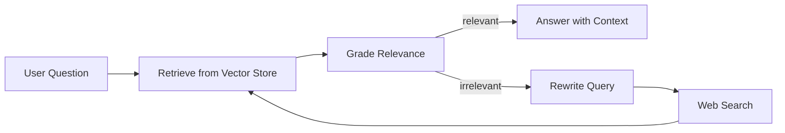

# 🤖 Agentic Notebooks (LangGraph + LangChain)

Hands-on Jupyter notebooks covering **agents**, **tool-calling**, and **RAG (Retrieval-Augmented Generation)** using LangGraph/LangChain with multiple vector store backends.

## 📑 Table of Contents
- [🏷️ Badges](#badges)
- [🖼️ Ecosystem Logos](#ecosystem-logos)
- [📌 What You’ll Find Here](#what-youll-find-here)
- [🗺️ Notebook Guide (Crisp Map)](#notebook-guide-crisp-map)
- [🔁 Visual: Corrective RAG Loop (High Level)](#visual-corrective-rag-loop-high-level)
- [🧰 Tech Stack (What’s Used)](#tech-stack-whats-used)
- [🚀 Quickstart (Local)](#quickstart-local)
- [📁 Data Folders](#data-folders)

## 🏷️ Badges

## 🖼️ Ecosystem Logos
| Tech | Logo | Link |
|---|---:|---|
| Hugging Face |  | https://huggingface.co |
| LangChain |  | https://python.langchain.com |
| LangGraph |  | https://langchain-ai.github.io/langgraph/ |
| LangSmith |  | https://smith.langchain.com |
| AutoGen |  | https://microsoft.github.io/autogen/ |
| n8n |  | https://n8n.io |
| Agentic AI |  | https://www.ibm.com/think/topics/agentic-ai |

## 📌 What You’ll Find Here
- Build blocks: prompts, chains, embeddings, loaders, and vector stores
- RAG: chunking → embedding → retrieval → generation
- Agent patterns: tool calling, routing, memory, and “corrective” retrieval loops

## 🗺️ Notebook Guide (Crisp Map)

### 🧩 LangGraph (agent graphs, tools, state)
| Notebook | What it covers | Key concepts |
|---|---|---|
| [langgraph_intro.ipynb](langgraph/langgraph_intro.ipynb) | First steps with StateGraph and state passing | Typed state, node functions, message/state updates |
| [langgraph_Agentic_Class_2.ipynb](langgraph/langgraph_Agentic_Class_2.ipynb) | Embeddings + Chroma retrieval wired into an agent-style state | HuggingFace embeddings, Chroma retriever, structured state |
| [langgrapha_Agentic_Class_3.ipynb](langgraph/langgrapha_Agentic_Class_3.ipynb) | Graph with and without tool calling | ToolNode, custom tools, message history, memory patterns |
| [langgraph_Agentic_Class_4.ipynb](langgraph/langgraph_Agentic_Class_4.ipynb) | Tool binding and tool selection behavior | bind_tools, inbuilt search tools, tool routing conditions |
| [tools.ipynb](langgraph/tools.ipynb) | Minimal custom tool examples | @tool, tool schemas, tool invocation |
| [Agentic RAG Class 5.ipynb](langgraph/Agentic%20RAG%20Class%205.ipynb) | End-to-end RAG from web content | Web loaders, splitting, embedding, retrieval, generation |
| [Corrective RAG Class 5.ipynb](langgraph/Corrective%20RAG%20Class%205.ipynb) | “Corrective RAG”: grade → rewrite → fallback search | Relevance grading, JSON parsing, query rewrite, web search fallback |
| [MultiAgent_Class_6.ipynb](langgraph/MultiAgent_Class_6.ipynb) | Advanced agent behaviors with tools (and demos) | ReAct-style agent usage, commands, tool execution, search/code tools |

### 🧱 LangChain (foundations, ingestion, vector DBs)
| Notebook | What it covers | Key concepts |
|---|---|---|
| [basics.ipynb](langchain/basics.ipynb) | Core LangChain building blocks | prompts, chains, model invocation, LangSmith env vars |
| [embeddings.ipynb](langchain/embeddings.ipynb) | Embedding text into vectors | HuggingFaceEmbeddings, vector dimensions, query vs doc embeddings |
| [data-ingestion.ipynb](langchain/data-ingestion.ipynb) | Loading documents from files | TextLoader, PDF loaders, lazy loading, document objects |
| [vectoredatabase.ipynb](langchain/FAISS/vectoredatabase.ipynb) | Vector similarity search + RAG with FAISS | cosine vs L2, FAISS indexing, retrieval, RAG patterns |
| [code.ipynb](langchain/Pinecone/code.ipynb) | Pinecone-backed vector store | index creation, upsert, query, PineconeVectorStore |

### ✅ Pydantic (structured outputs & validation)
| Notebook | What it covers | Key concepts |
|---|---|---|
| [pydantic.ipynb](pydantic/pydantic.ipynb) | Data validation vs plain dataclasses | BaseModel, type coercion, ValidationError, optional fields |

## 🔁 Visual: Corrective RAG Loop (High Level)

## 🧰 Tech Stack (What’s Used)
- LLMs: Groq (ChatGroq), optional Google GenAI integrations
- Embeddings: Sentence-Transformers via HuggingFaceEmbeddings
- Vector stores: ChromaDB, FAISS, Pinecone
- Search: Tavily, DuckDuckGo (ddgs)
- Parsing/validation: Pydantic (plus JSON output parsing patterns)
- Document ingestion: Text/PDF loaders (pypdf, pymupdf), BeautifulSoup (bs4)

## 🚀 Quickstart (Local)
1. Create a virtual environment and install deps:
   - `pip install -r requirements.txt`
2. Create a `.env` file (it is ignored by git) and set keys you plan to use:
   - `GROQ_API_KEY`
   - `HUGGINGFACE_API_KEY`
   - `TAVILY_API_KEY` (for Tavily search notebooks)
   - `PINECONE_API_KEY` (for Pinecone notebook)
   - `GOOGLE_API_KEY` (if using Google GenAI examples)
   - `LANGSMITH_API_KEY`, `LANGSMITH_PROJECT`, `LANGSMITH_TRACING_V2` (if tracing)
3. Open notebooks in Jupyter and run top-to-bottom.

## 📁 Data Folders
- [data/](data/) and [data2/](data2/) contain sample inputs used by some notebooks.
