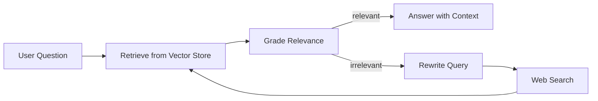

# 🤖 Agentic Notebooks (LangGraph + LangChain)

Hands-on Jupyter notebooks covering **agents**, **tool-calling**, and **RAG (Retrieval-Augmented Generation)** using LangGraph/LangChain with multiple vector store backends.

## 📌 What You’ll Find Here
- Build blocks: prompts, chains, embeddings, loaders, and vector stores
- RAG: chunking → embedding → retrieval → generation
- Agent patterns: tool calling, routing, memory, and “corrective” retrieval loops

## 🗺️ Notebook Guide (Crisp Map)

### 🧩 LangGraph (agent graphs, tools, state)
| Notebook | What it covers | Key concepts |
|---|---|---|
| [langgraph_intro.ipynb](langgraph/langgraph_intro.ipynb) | First steps with StateGraph and state passing | Typed state, node functions, message/state updates |
| [langgraph_Agentic_Class_2.ipynb](langgraph/langgraph_Agentic_Class_2.ipynb) | Embeddings + Chroma retrieval wired into an agent-style state | HuggingFace embeddings, Chroma retriever, structured state |
| [langgrapha_Agentic_Class_3.ipynb](langgraph/langgrapha_Agentic_Class_3.ipynb) | Graph with and without tool calling | ToolNode, custom tools, message history, memory patterns |
| [langgraph_Agentic_Class_4.ipynb](langgraph/langgraph_Agentic_Class_4.ipynb) | Tool binding and tool selection behavior | bind_tools, inbuilt search tools, tool routing conditions |
| [tools.ipynb](langgraph/tools.ipynb) | Minimal custom tool examples | @tool, tool schemas, tool invocation |
| [Agentic RAG Class 5.ipynb](langgraph/Agentic%20RAG%20Class%205.ipynb) | End-to-end RAG from web content | Web loaders, splitting, embedding, retrieval, generation |
| [Corrective RAG Class 5.ipynb](langgraph/Corrective%20RAG%20Class%205.ipynb) | “Corrective RAG”: grade → rewrite → fallback search | Relevance grading, JSON parsing, query rewrite, web search fallback |
| [Network Multi Agent_Class_6.ipynb](langgraph/Network%20Multi%20Agent_Class_6.ipynb) | Advanced agent behaviors with tools (and demos) | ReAct-style agent usage, commands, tool execution, search/code tools |
| [Supervisor Multi Agent Class 7.ipynb](langgraph/Supervisor%20Multi%20Agent%20Class%207.ipynb) | Supervisor agent orchestrating specialist agents | supervisor agent, delegation, role-based agents |
| [Human-In-Loop Class 8.ipynb](langgraph/Human-In-Loop%20Class%208.ipynb) | Human-in-the-loop interventions in agent workflows | human feedback, approvals, intervention points |

### 🧱 LangChain (foundations, ingestion, vector DBs)
| Notebook | What it covers | Key concepts |
|---|---|---|
| [basics.ipynb](langchain/basics.ipynb) | Core LangChain building blocks | prompts, chains, model invocation, LangSmith env vars |
| [embeddings.ipynb](langchain/embeddings.ipynb) | Embedding text into vectors | HuggingFaceEmbeddings, vector dimensions, query vs doc embeddings |
| [data-ingestion.ipynb](langchain/data-ingestion.ipynb) | Loading documents from files | TextLoader, PDF loaders, lazy loading, document objects |
| [vectoredatabase.ipynb](langchain/FAISS/vectoredatabase.ipynb) | Vector similarity search + RAG with FAISS | cosine vs L2, FAISS indexing, retrieval, RAG patterns |
| [code.ipynb](langchain/Pinecone/code.ipynb) | Pinecone-backed vector store | index creation, upsert, query, PineconeVectorStore |

### ✅ Pydantic (structured outputs & validation)
| Notebook | What it covers | Key concepts |
|---|---|---|
| [pydantic.ipynb](pydantic/pydantic.ipynb) | Data validation vs plain dataclasses | BaseModel, type coercion, ValidationError, optional fields |

### 🤝 AutoGen (multi-agent workflows and tools)
| Notebook | What it covers | Key concepts |
|---|---|---|
| [first autogen agent.ipynb](autogen/first%20autogen%20agent.ipynb) | Your first AutoGen agent with a basic task | single agent, prompts, run loop |
| [Autogen Agents.ipynb](autogen/Autogen%20Agents.ipynb) | Core AutoGen agent patterns | user proxy, assistant agents, conversations |
| [Autogen Agents Tools.ipynb](autogen/Autogen%20Agents%20Tools.ipynb) | Using tools with AutoGen agents | tool calling, code execution, retrieval tools |
| [Autogen Teams.ipynb](autogen/Autogen%20Teams.ipynb) | Teams of cooperating agents | multi-agent teams, roles, coordination |
| [Autogen Graph Flow.ipynb](autogen/Autogen%20Graph%20Flow.ipynb) | Graph-style workflows in AutoGen | workflow graphs, routing, multi-step tasks |
| [Selection Group Chat.ipynb](autogen/Selection%20Group%20Chat.ipynb) | Group chat with agent selection | group chat, speaker selection, collaboration |
| [Human in the loop.ipynb](autogen/Human%20in%20the%20loop.ipynb) | Human supervision in AutoGen flows | human approvals, intervention, oversight |
| [Human in the loop Outside.ipynb](autogen/Human%20in%20the%20loop%20Outside.ipynb) | Human-in-the-loop with external context | external tools, human feedback, review loops |

## 🔁 Visual: Corrective RAG Loop (High Level)

